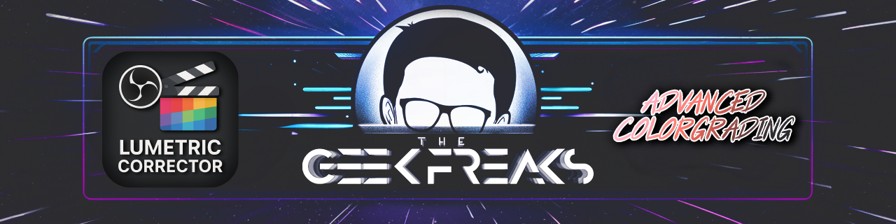

  <h1>🎬 Lumetric Corrector for OBS Studio</h1>
  
A professional color correction and grading filter plugin for OBS Studio with advanced customization options.

  
Perfect for streamers, content creators, and videographers seeking cinematic quality.

  
  
  
  
  
  
  
  
  

  

## 📑 Table of Contents
- [✨ Key Features](#-key-features)
- [🎯 Use Cases](#-use-cases)
- [💻 Installation](#-installation)
- [🎨 Color Presets](#-color-presets)
- [🛠️ Configuration](#️-configuration)
- [🎮 Usage](#-usage)
- [🔧 Troubleshooting](#-troubleshooting)
- [📄 License](#-license)
- [📝 Changelog](#-changelog)

## ✨ Key Features

### 🖌️ Professional Color Correction
- **Comprehensive Adjustment Tools**: 
  - Exposure, contrast, brightness controls
  - Highlights and shadows recovery
  - Whites and blacks level adjustment
  - Temperature and tint for white balance
- **Advanced Color Grading**:
  - RGB control for shadows, midtones, and highlights
  - Saturation and vibrance enhancement
  - Fine-tuned color balance for cinematic looks

  

### 🎨 Creative Color Control
- **25+ Professional Presets**:
  - Mood-based presets like Cinematic, Teal & Orange, Dramatic Contrast
  - Era-specific looks including 80s Retro, 90s VHS, 70s Film
  - Creative color styles such as Cyberpunk, Desert Heat, Arctic Chill
- **Additional Effects**:
  - Vignette with adjustable radius and feathering
  - Film grain simulation with size control
  - Real-time preview for immediate visual feedback

  

### ⚙️ Professional Features
- **Performance Optimized**:
  - Low CPU/GPU impact for streaming
  - Real-time adjustments without frame drops
  - Compatible with other OBS filters
- **Localization**:
  - Built-in support for English and German
  - Easily expandable to other languages
  - Automatic language detection

## 🎯 Use Cases

### Streaming Enhancement
- Achieve professional broadcast quality
- Create consistent visual branding through color
- Correct problematic lighting in gaming setups
- Match colors across different cameras or scenes

  

### Content Creation
- Apply film-like color grading to video productions
- Correct white balance and exposure issues
- Create mood-specific looks for different content types
- Maintain consistent color across editing workflows

### Creative Expression
- Develop signature visual styles with custom color grading
- Simulate vintage film stocks or modern cinema looks
- Create genre-specific aesthetics (horror, sci-fi, drama)
- Enhance viewer engagement with polished visuals

  

## 💻 Installation

1. Download the latest release from the [Releases](https://github.com/The-Geek-Freaks/lumetric_corrector/releases) page
2. Place the script in your OBS scripts folder:
   - Windows: `%APPDATA%\obs-studio\scripts`
   - macOS: `~/Library/Application Support/obs-studio/scripts`
   - Linux: `~/.config/obs-studio/scripts`
3. In OBS Studio:
   - Go to Tools → Scripts
   - Click the + button
   - Select the downloaded `lumetric_corrector.lua` file
   - Add as a filter to any source or scene

  

### Platform-Specific Notes

#### Windows
- Compatible with Windows 10/11
- OBS Studio 30.0+ recommended
- No additional dependencies required

#### macOS
- Compatible with macOS 11.0 (Big Sur) or higher
- OBS Studio 30.0+ recommended
- No additional dependencies required

#### Linux
- Compatible with most modern distributions
- OBS Studio 30.0+ recommended
- No additional dependencies required

## 🎨 Color Presets

### Mood Presets
Lumetric Corrector includes professionally designed presets for instant looks:

1. **Cinematic**: Film-like appearance with balanced contrast
2. **Teal & Orange**: Popular Hollywood color grading
3. **Vintage Film**: Classic film emulation
4. **Dramatic Contrast**: Enhanced shadows and highlights
5. **Bleach Bypass**: Desaturated high-contrast look
6. **Moody Blue**: Cool-toned atmospheric grading
7. **Horror Tone**: Dark and unsettling color palette
8. **Warm Portrait**: Flattering skin tones enhancement

  

### Era Presets
Create period-specific looks:

- **80s Retro**: Bright colors with subtle contrast
- **90s VHS**: Worn video look with shifted colors
- **70s Film**: Warm vintage aesthetic
- **Sepia Tone**: Classic antique photo look
- **Black & White**: Monochromatic conversion

  

### Color Style Presets
Creative color treatments:

- **Faded Shadows**: Matte look with lifted shadows
- **Cross Process**: Alternative processing simulation
- **Day For Night**: Simulated nighttime from day footage
- **Night Enhancer**: Improved visibility in dark scenes
- **Sunset Glow**: Warm golden hour lighting
- **Forest Green**: Nature-focused color palette
- **Desert Heat**: Warm arid environment simulation
- **Arctic Chill**: Cold blue-tinted environment
- **Cyberpunk**: Futuristic neon-inspired grading

  

## 🛠️ Configuration

### Basic Color Correction
1. **Exposure & Contrast**:
   - Exposure: Overall brightness adjustment (-1.0 to 1.0)
   - Contrast: Tonal range expansion/compression (-1.0 to 1.0)
   - Brightness: Fine-tuning of mid-range luminance (-1.0 to 1.0)

2. **Tone Controls**:
   - Highlights: Recover or enhance bright areas (-1.0 to 1.0)
   - Shadows: Control dark area details (-1.0 to 1.0)
   - Whites: Adjust white point (-1.0 to 1.0)
   - Blacks: Set black level (-1.0 to 1.0)

3. **Color Balance**:
   - Temperature: Warm/cool color shift (-1.0 to 1.0)
   - Tint: Green/magenta balance (-1.0 to 1.0)
   - Saturation: Color intensity (-1.0 to 1.0)
   - Vibrance: Intelligent saturation enhancement (-1.0 to 1.0)

  

### Advanced Color Grading
1. **Shadows Color Wheels**:
   - Red/Green/Blue: Independent control of shadow colors (-1.0 to 1.0)

2. **Midtones Color Wheels**:
   - Red/Green/Blue: Independent control of midtone colors (-1.0 to 1.0)

3. **Highlights Color Wheels**:
   - Red/Green/Blue: Independent control of highlight colors (-1.0 to 1.0)

### Effects
1. **Vignette**:
   - Amount: Intensity of darkening (0.0 to 1.0)
   - Radius: Size of the effect (0.0 to 1.0)
   - Feather: Edge softness (0.0 to 1.0)

2. **Film Grain**:
   - Amount: Intensity of grain effect (0.0 to 1.0)
   - Size: Grain particle size (0.0 to 100.0)

## 🎮 Usage

### Adding the Filter
1. In OBS Studio, select the source or scene you want to apply color correction to
2. Right-click and select "Filters"
3. Click the "+" button under "Effect Filters"
4. Select "Lumetric Corrector"

### Quick Start Guide
1. **Using Presets**:
   - Select a preset from the dropdown menu
   - Click "Apply Preset" to apply the selected look
   - Fine-tune individual parameters as needed

2. **Manual Adjustment**:
   - Start with exposure and contrast to set overall levels
   - Adjust temperature and tint to fix white balance
   - Use shadows and highlights to recover details
   - Apply color grading using RGB controls for each tonal range
   - Add effects like vignette or grain for finishing touches

### Tips for Best Results
- Start with subtle adjustments to avoid over-processed looks
- Use presets as starting points rather than final settings
- Consider the mood and purpose of your content when selecting colors
- Save your custom settings for consistency across projects

## 🔧 Troubleshooting

### Common Issues
1. **Filter not appearing**:
   - Ensure OBS Studio is updated to version 30.0 or higher
   - Check that the script is in the correct scripts folder
   - Restart OBS Studio after adding the script

2. **Performance issues**:
   - Reduce the number of simultaneous filters
   - Lower the quality settings in OBS
   - Check system resource usage during streaming

3. **Color looking incorrect**:
   - Reset all parameters to default and start again
   - Check if multiple color filters are conflicting
   - Ensure your monitor is calibrated correctly

### Support
If you encounter issues not covered here, please:
- Create an issue on the [GitHub repository](https://github.com/The-Geek-Freaks/lumetric_corrector/issues)
- Include your system specifications and OBS Studio version
- Provide clear steps to reproduce the problem

## 📝 Changelog

Siehe [CHANGELOG.md](./CHANGELOG.md) für eine vollständige Liste aller Änderungen und Verbesserungen.

### Neu in Version 1.3.0 – Creative Effects Update
- **Highlight/Shadow Fade**: New sliders for creative film looks and bleaching effects
- **Adjustable Vignette**: Vignette shape can now be modified from circular to oval/rectangular
- **Living Film Grain**: Realistically animated film grain with improved time effects

## 📄 License
This project is licensed under the GNU General Public License v3.0 - see the LICENSE file for details.

---

  
Created with 💙 for the content creation community

